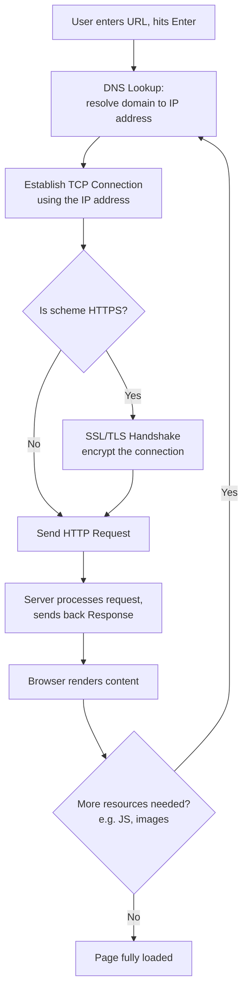

### Anatomy of a URL

A **URL (Universal Resource Locator)** has four parts:

| Part | Example (`http://example.com/path/resource`) | Meaning |
|---|---|---|
| **Scheme** | `http://` | Tells the browser which protocol to use to connect to the server (e.g. HTTP, HTTPS) |
| **Domain** | `example.com` | The domain name of the site |
| **Path** | `/path` | Like a directory in a file system |
| **Resource** | `/resource` | Like a file in a file system |

> [!note]
> With **HTTPS**, the connection between browser and server is encrypted (as opposed to plain HTTP).

---

### The High-Level Flow



---

### Step 1: DNS Lookup

- **[[DNS]] (Domain Name System)** translates a domain name (e.g. `example.com`) into an IP address the browser can actually connect to — often described as "the phone book of the internet."
- To keep lookups fast, DNS answers are **cached at multiple layers**, checked in this order:
  1. **Browser cache** — checked first, holds the answer for a short period.
  2. **Operating system cache** — checked next if the browser doesn't have it.
  3. **DNS resolver (out on the internet)** — only queried if neither cache has an answer. This kicks off a chain of requests across DNS infrastructure until the IP address is resolved.

> [!tip]
> The DNS resolution process itself involves many servers and caching at every step — it's complex enough to be its own topic (root servers, TLD servers, authoritative servers, etc.), separate from HTTP itself.

---

### Step 2: Establish a TCP Connection

- Once the browser has the server's IP address, it establishes a **TCP connection** to it.
- This requires a **handshake**, which takes several network round trips to complete.
- To avoid repeating this cost for every request, modern browsers use **keep-alive connections** — reusing an already-established TCP connection whenever possible.

---

### Step 3: SSL/TLS Handshake (HTTPS Only)

- If the scheme is **HTTPS**, establishing the connection requires an additional, more involved step: the **SSL/TLS handshake**, which creates the encrypted channel between browser and server.
- This handshake is **expensive** (adds more round trips/latency).
- Browsers reduce this cost using techniques like **SSL session resumption**, which lets a browser reuse parameters from a previous handshake instead of doing the full process again.

---

### Step 4: HTTP Request & Response

- With the connection (and encryption, if applicable) established, the browser sends an **HTTP request** to the server.
- HTTP itself is described as **a very simple protocol**: the server processes the request and sends back a response.
- The browser receives the response and **renders the HTML content**.

---

### Step 5: Loading Additional Resources

- A single page often needs more than just the HTML — e.g. **JavaScript bundles** and **images**.
- For each additional resource, the browser **repeats the entire process**: DNS lookup → TCP connection → HTTP request/response.
- Caching (DNS, TCP keep-alive, etc.) is what keeps this repeated process fast rather than starting completely from scratch each time.

---

#### Key Takeaways
- A URL breaks down into four parts: **scheme**, **domain**, **path**, and **resource**.
- Loading a page starts with a **DNS lookup** to convert the domain name into an IP address, checked against browser cache → OS cache → external DNS resolver, in that order.
- The browser then establishes a **TCP connection** to that IP address, involving a handshake that browsers try to avoid repeating via **keep-alive connections**.
- If the site uses **HTTPS**, an additional **SSL/TLS handshake** encrypts the connection — an expensive step optimized via **SSL session resumption**.
- Once connected, the browser sends an **HTTP request** and the server returns a **response**, which the browser renders.
- Additional page resources (JS, images, etc.) each repeat the full DNS → TCP → HTTP cycle.
- This entire process is fast in practice largely because of aggressive caching at nearly every stage.


##### For more information look at the resource below 


```cardlink
url: https://www.youtube.com/watch?v=vvpCnjyjTuU&t=267s
title: "What happens when you type a URL in the web browser and press Enter? Computer Stuff #18"
description: "What happens when you type a URL in the web browser and press Enter? Computer Stuff They Didn't Teach You #18We talk about TCP/IP, DNS, HTTP, HTTPS, Http Res..."
host: www.youtube.com
favicon: https://www.youtube.com/s/desktop/2e7138bb/img/favicon_32x32.png
image: https://i.ytimg.com/vi/vvpCnjyjTuU/maxresdefault.jpg
```

