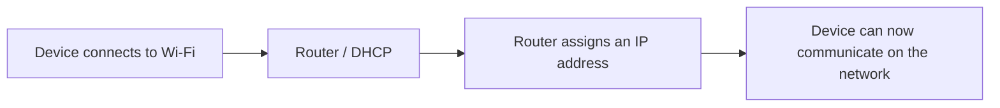
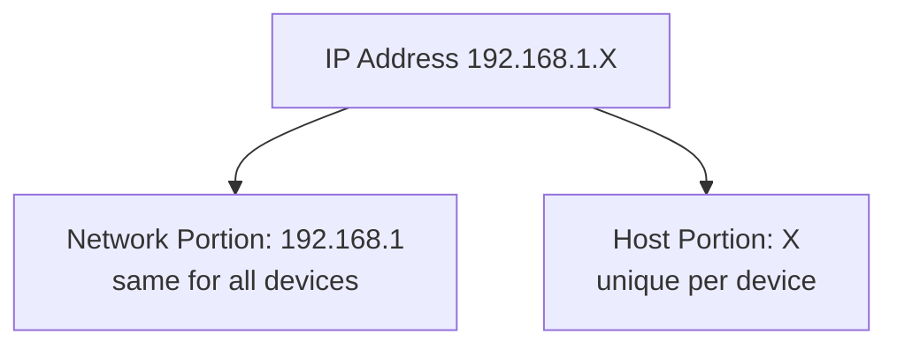
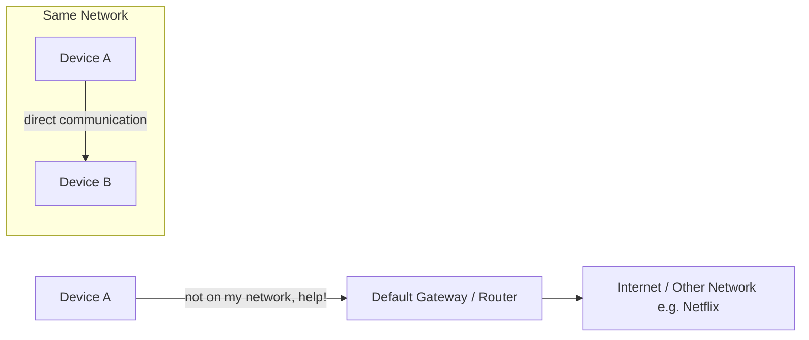

[[1. Client Server model]]
### What Is an IP Address?

- An **IP (Internet Protocol) address** is like a phone number for a device — it lets devices communicate with each other and with the internet.
- Any device that needs to talk to another device (locally or on the internet) needs an IP address.
- Example: the device you're watching a YouTube video on has an IP address because it's exchanging data with YouTube's servers.

> [!note]
> The analogy used throughout: an IP address works like a mailing address — it tells other devices "where" you are so they know how to reach you.

---

### Finding Your IP Address

| Platform | Command / Steps |
|---|---|
| Windows | Open **cmd** (Command Prompt), type `ipconfig` |
| Mac / Linux | Open **Terminal**, type `ifconfig` |
| Phone | Settings → Wi-Fi info → view network details |

- On Windows, look for **IPv4 Address**. Ignore the "v4" for now — it's not important yet.
- Alongside the IP address you'll also see two related values:
  - **Subnet Mask** (also called **Netmask** on Mac/Linux)
  - **Default Gateway** (also called **default router**, or just **router**)

---

### The Three Key Players

#### [[IP Address]]
- A set of four numbers separated by dots (e.g. `192.168.1.15`).
- Each number can range from **0–255**.

#### [[Subnet Mask]]
- Also uses the four-number, dot-separated format.
- Works alongside the IP address to define which part of it is the **network portion** and which part is the **host portion**.
- Common home network subnet mask: `255.255.255.0`.

#### [[Default Gateway]]
- Usually your **router**.
- Devices use it to reach anything **outside** their own network (e.g. Netflix, external websites).

---

### How Devices Get an IP Address ([[DHCP]])

- On Wi-Fi networks, your **router** automatically assigns IP addresses to devices as they connect.
- This automatic assignment process is called **DHCP** (Dynamic Host Configuration Protocol) — covered in more depth in a future video.
- This is why most home IP addresses start with `192.168.1` — it's simply the default range the router (via DHCP) has been configured to hand out.

---

### Reading the Subnet Mask: The "255 Hack"

- The subnet mask lines up **octet-by-octet** with the IP address (1st with 1st, 2nd with 2nd, etc.).
- **The trick:**
  - If an octet in the subnet mask is **255** → the matching octet in the IP address is **fixed** (same for every device on the network).
  - If an octet in the subnet mask is **0** → the matching octet in the IP address **can vary** (it's what changes per device).

**Example:**

| | Octet 1 | Octet 2 | Octet 3 | Octet 4 |
|---|---|---|---|---|
| IP Address | 192 | 168 | 1 | (varies) |
| Subnet Mask | 255 | 255 | 255 | 0 |

- Fixed portion (`192.168.1`) = **Network Portion**
- Variable portion (last octet) = **Host Portion**

> [!tip]
> A device on a network is called a **host**. The host portion of the IP address is what makes each device on the same network unique.

---

### Network Portion vs. Host Portion — The Street Analogy

- Think of the **network portion** as your **street name** (e.g. "Privet Drive") — every house on it shares the same street name.
- Think of the **host portion** as your **house number** — it's what makes your address unique on that street.

**Why this matters:**
- If two devices share the same network portion (same "street"), they can talk **directly** to each other — no router needed.
- If a device wants to reach something **outside** its network (a different "street" — e.g. Netflix), it has to send the request through the **default gateway** (the router), which knows how to route traffic elsewhere.

---

### Reserved IP Addresses (Not Usable by Devices)

Within any given network, **two addresses are always reserved** and cannot be assigned to a device:

| Reserved Address | Role | Example (for network `192.168.1.0`) |
|---|---|---|
| **Network Address** | The first address in the network; identifies the network itself | `192.168.1.0` |
| **Broadcast Address** | The last address in the network; sending data here sends it to **every** device on the network | `192.168.1.255` |

> [!warning]
> Neither the network address nor the broadcast address can be assigned to an individual device — attempting to use them causes issues, since they have special network-wide meaning.

---

### Calculating Usable IP Addresses

Using the common home network example (`192.168.1.0` with subnet mask `255.255.255.0`):

1. Total possible values in the host octet (0–255) = **256**
2. Subtract the **network address** = −1
3. Subtract the **broadcast address** = −1
4. Subtract the **default gateway/router**, which also takes one address = −1

**Result: 256 − 3 = 253 usable IP addresses** available for devices on that network.

> [!note]
> The video initially says "250 usable" in the recap, but walks through the math as 256 − 3 = 253. Worth double-checking against the next episode in the series if the exact number matters for your notes.

---

#### Key Takeaways
- An IP address is a unique identifier that lets a device communicate on a network and the internet.
- You can view your device's IP address via `ipconfig` (Windows), `ifconfig` (Mac/Linux), or your phone's Wi-Fi settings.
- The **subnet mask** determines which part of the IP address is the network portion (fixed) vs. the host portion (variable).
- A subnet mask octet of **255** = fixed; an octet of **0** = variable ("the 255 hack").
- The **network portion** is like a street name; the **host portion** is like a house number.
- Devices on the same network portion communicate directly; devices needing to reach outside their network go through the **default gateway** (router).
- **DHCP** is the process by which routers automatically assign IP addresses to connecting devices.
- Every network reserves two addresses it cannot use: the **network address** (first) and the **broadcast address** (last).
- A typical home network (`/24`, subnet mask `255.255.255.0`) has 256 total addresses, minus the network address, broadcast address, and the router itself, leaving usable addresses for other devices.

#### Quick Reference
| Command / Function | Purpose | Example |
|---|---|---|
| `ipconfig` | View IP configuration on Windows | Open cmd → type `ipconfig` |
| `ifconfig` | View IP configuration on Mac/Linux | Open terminal → type `ifconfig` |
