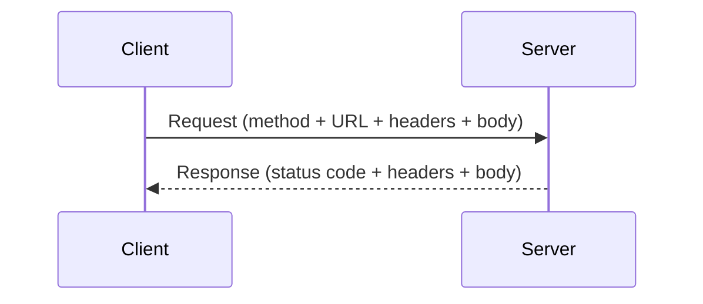
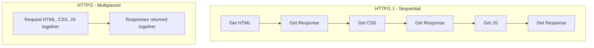

---


```cardlink
url: https://github.com/2Kronos/Computer-Engineering-Knowledge-/tree/master/Uni%20vault/YEAR%203/Network%20System/Chapters/Chapter%202
title: "Computer-Engineering-Knowledge-/Uni vault/YEAR 3/Network System/Chapters/Chapter 2 at master · 2Kronos/Computer-Engineering-Knowledge-"
description: "Contribute to 2Kronos/Computer-Engineering-Knowledge- development by creating an account on GitHub."
host: github.com
favicon: https://github.githubassets.com/favicons/favicon.svg
image: https://opengraph.githubassets.com/6af039d2754851201149f6936e0a731d6db6418aa5fb4c83f6a4ac7a0ee4c0ec/2Kronos/Computer-Engineering-Knowledge-
```


### What Is HTTP?

- **HTTP** = **HyperText Transfer Protocol** — the protocol responsible for communication between web servers and clients. It's "the protocol of the web."
- Anytime you open a browser, visit a page, submit a form, or trigger an AJAX/fetch request, you're using HTTP.
- This happens through the **request/response cycle**:
    - You make a **request**.
    - You get a **response** back, which includes **headers** and a **body**.



#### HTTP Is Stateless

- Every request is **completely independent** — the server doesn't remember anything about a previous request.
- Each request can be thought of as its own separate transaction.
- To maintain state across requests (e.g. staying logged in), you need extra tools like:
    - Local storage
    - Cookies
    - Sessions

---

### HTTPS

- **HTTPS** = **HyperText Transfer Protocol Secure**.
- Data sent back and forth is encrypted using:
    - **SSL** (Secure Sockets Layer), or
    - **TLS** (Transport Layer Security)
- Always use HTTPS when handling sensitive data (credit card numbers, social security numbers, contact forms, etc.).
- Many sites now force HTTPS on every page.
- Enabled by installing an **SSL certificate** on your web host. Different certificate levels/security tiers exist.

---

### HTTP Methods

The four main methods you'll work with most often:

|Method|Purpose|Example|
|---|---|---|
|**GET**|Fetch/retrieve data from the server|Loading a webpage, CSS, images, JSON/XML data|
|**POST**|Send/add new data to the server|Submitting a contact form, creating a new blog post|
|**PUT**|Update existing data on the server|Editing a blog post's text or image|
|**DELETE**|Remove data from the server|Deleting a blog post|

> [!note] Forms _can_ use GET, but it's less secure — the submitted data becomes visible in the URL. GET forms are generally only appropriate for things like search/filter forms where you're not actually posting new data.

---

### Headers and Body

Every request and response involves:

- A **body** — the actual content:
    - Response body: the HTML page, JSON data, etc. being returned
    - Request body: e.g. the fields submitted in a form
- **Headers** — metadata about the request/response, split into three sections:
    1. **General**
    2. **Request headers**
    3. **Response headers**

A typical request line looks like: `GET /path HTTP/1.1` — method, path/URL, and protocol version.

#### Common General Fields

|Field|Meaning|
|---|---|
|Request URL|The URL being requested|
|Request Method|GET, POST, etc.|
|Status Code|Result of the request (see status codes below)|
|Remote Address|IP of the remote server|
|Referrer Policy|Info passed when navigating from another page|

#### Common Response Header Fields

|Field|Meaning|
|---|---|
|Server|The server software (e.g. Apache, Nginx) — often hidden for security|
|Set-Cookie|Server sending a small piece of data (a cookie) to the client|
|Content-Type|The type of content being returned|
|Content-Length|Length of the response body, in octets (8-bit bytes)|
|Date|Timestamp of the response|

**Common Content-Type values:**

|Content Type|Used For|
|---|---|
|`text/html`|HTML pages|
|`text/css`|CSS files|
|`image/png`, `image/jpeg`|Images|
|`application/json`|JSON data|

#### Common Request Header Fields

|Field|Meaning|
|---|---|
|Cookie|Sends a previously-received cookie back to the server|
|Accept-Encoding / Accept-Charset / Accept-Language|What encodings/character sets/languages the client can understand|
|Content-Type|Type of data being sent in the request body (e.g. `application/json`)|
|Content-Length|Length of the request body|
|Authorization|Used to send a token (e.g. for authenticating a protected route), when not using server-side sessions|
|User-Agent|String describing the client's OS/browser/software|
|Referer|Info about the site the user came from|

> [!tip] Since HTTP is stateless, sending a token in the `Authorization` header (or a custom header like `X-Auth-Token`) is a common way to authenticate requests to protected routes.

---

### HTTP Status Codes

Status codes fall into five ranges:

|Range|Meaning|
|---|---|
|**1xx**|Informational — request received, processing continues|
|**2xx**|Success — request was received, understood, and accepted|
|**3xx**|Redirection — further action needed|
|**4xx**|Client error — something is wrong with the request itself|
|**5xx**|Server error — server failed to fulfill an apparently valid request|

**Common specific codes to memorize:**

|Code|Meaning|
|---|---|
|200|OK — everything worked|
|201|Created — e.g. successfully created a new blog post|
|301|Moved permanently — redirection|
|304|Not Modified — cached response, content hasn't changed|
|400|Bad Request — client didn't send the required data|
|401|Unauthorized — missing/invalid authentication (e.g. missing token)|
|404|Not Found — resource doesn't exist|
|500|Internal Server Error — something went wrong server-side|

---

### HTTP/2

- Builds on HTTP/1.1 — the changes are mostly "under the hood," so status codes and application logic stay the same.
- Key benefit: **reduces latency via full request/response multiplexing** — faster and more efficient.



---

### Inspecting HTTP in the Browser (DevTools)

- Open **DevTools → Network tab**, then reload the page to see every request the browser makes.
- Each request shows: type, status, size, and timing.
- Clicking a request shows:
    - **Response** tab → the body (HTML, JSON, etc.)
    - **Headers** tab → general / response / request headers
- **XHR** filter shows AJAX/fetch requests specifically (used by `fetch`, `axios`, etc.).

---

### Testing HTTP with Postman

**Postman** is an HTTP client useful for testing APIs directly (available at postman.com).

- Lets you make GET, POST, PUT, PATCH, DELETE (and more) requests to any URL.
- Shows the same response data browsers show (body, headers, cookies, status, load time, size) — but gives you more control, since you can freely set headers, body, and method (unlike a browser, which is limited mostly to GET via URL navigation).

---

### Building a Request/Response Cycle with Express (Node.js)

> [!note] Express was used here specifically because it doesn't abstract away the request/response cycle — you interact with headers, body, and status codes directly, which makes it a clear teaching example (even if you don't know Express itself).

#### Basic GET Route

```javascript
app.get('/', (req, res) => {
  res.send('Hello from Express');
});
```

- `res.send()` sends data back to the client.
- By default, `res.send()` with a string sets `Content-Type` to `text/html` — Express tries to detect the appropriate content type automatically.
- Use `res.json()` explicitly when sending JSON data.

#### Reading Header Values

```javascript
app.get('/', (req, res) => {
  res.send(req.header('host'));       // get a specific header
  res.send(req.header('user-agent')); // e.g. differs between Postman and a browser
  res.send(req.rawHeaders);           // get ALL headers as an array
});
```

#### Reading the Request Body

```javascript
app.post('/contact', (req, res) => {
  console.log(req.body); // the submitted form/JSON data
});
```

- `req.body` requires the appropriate Express middleware to parse JSON or form-encoded data — otherwise it comes back empty.
- Sending form data (`www-form-urlencoded`) or raw JSON from Postman automatically sets the matching `Content-Type` header.

#### Sending Custom Status Codes

```javascript
app.post('/contact', (req, res) => {
  if (!req.body.name) {
    return res.status(400).send('Name is required');
  }

  res.status(201).send(`Thank you ${req.body.name}`);
});
```

- `res.status(400)` — bad request (missing required data)
- `res.status(201)` — created successfully

> [!warning] Always `return` a response inside a conditional if there's another response call later in the function — otherwise you'll get a **"headers already sent"** error, because Express tries to send more than one response for the same request.

#### Reading Header Values for Simple Token Auth

```javascript
app.post('/login', (req, res) => {
  if (!req.header('x-auth-token')) {
    return res.status(400).send('No token');
  }

  if (req.header('x-auth-token') !== '123456') {
    return res.status(401).send('Not authorized');
  }

  res.send('Logged in');
});
```

- Demonstrates simple (non-JWT) token validation using a custom header, `x-auth-token`.
- In real apps, you'd validate an actual JSON Web Token (JWT) instead of a hardcoded string.

#### PUT and DELETE Example

```javascript
app.put('/posts/:id', (req, res) => {
  // ...update the post in the database using req.params.id...
  res.json({ id: req.params.id, title: req.body.title });
});

app.delete('/posts/:id', (req, res) => {
  // ...delete the post from the database...
  res.send(`Post ${req.params.id} deleted`);
});
```

- `req.params` → accesses values from the **URL** (e.g. `:id`)
- `req.body` → accesses data sent in the **request body**

#### Serving Static Files

```javascript
app.use(express.static('public'));
```

- Sets a folder (e.g. `public/`) to be served directly as static files — useful for plain HTML/CSS/JS sites.
- Files placed inside (e.g. `public/index.html`, `public/css/style.css`, `public/js/main.js`) become accessible without defining explicit routes for them.
- Linked via normal HTML tags:
    
    ```html
    <link rel="stylesheet" href="css/style.css"><script src="js/main.js"></script>
    ```
    
- These separate file requests (HTML, CSS, JS) are all visible individually in the DevTools Network tab, each with its own `Content-Type`.

---

### Deployment Note

- In production, a Node.js/Express app isn't served directly from something like port 5000.
- Instead, it typically sits behind a **reverse proxy** (e.g. **Nginx**), with additional configuration.
- The core mechanics of HTTP (sending/receiving requests and responses) stay the same regardless of deployment setup.

---

#### Key Takeaways

- HTTP is the protocol governing all communication between clients and servers on the web, built around a request/response cycle.
- HTTP is **stateless** — each request is independent; cookies/sessions/local storage are needed to persist state.
- **HTTPS** encrypts data using SSL/TLS and should be used for any sensitive data.
- The four core HTTP methods are **GET** (read), **POST** (create), **PUT** (update), **DELETE** (remove).
- Requests and responses both carry **headers** (metadata) and a **body** (actual content).
- **Status codes** are grouped by range: 1xx info, 2xx success, 3xx redirect, 4xx client error, 5xx server error — memorize 200, 201, 301, 304, 400, 401, 404, 500.
- **HTTP/2** improves performance over 1.1 via multiplexing, without changing how developers write application logic.
- Browser DevTools (Network tab) and tools like **Postman** let you inspect and test the full request/response cycle directly.
- In Express, `req.header()`/`req.rawHeaders` read headers, `req.body` reads the request body (with middleware), `req.params` reads URL parameters, and `res.status()` sets the response status code.

#### Quick Reference

|Command / Function|Purpose|Example|
|---|---|---|
|`res.send()`|Send a response (auto-detects content type)|`res.send('Hello')`|
|`res.json()`|Send a JSON response explicitly|`res.json({ msg: 'hello' })`|
|`res.status()`|Set the response's HTTP status code|`res.status(404).send('Not found')`|
|`req.header()`|Read a specific request header|`req.header('user-agent')`|
|`req.rawHeaders`|Get all request headers as an array|`req.rawHeaders`|
|`req.body`|Access the request body (needs middleware)|`req.body.name`|
|`req.params`|Access URL route parameters|`req.params.id`|
|`express.static()`|Serve a folder of static files|`app.use(express.static('public'))`|