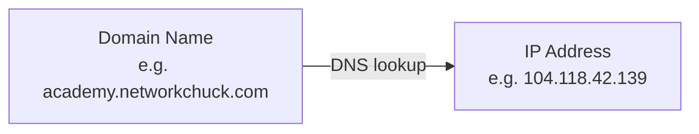
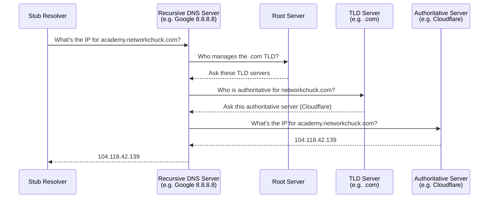
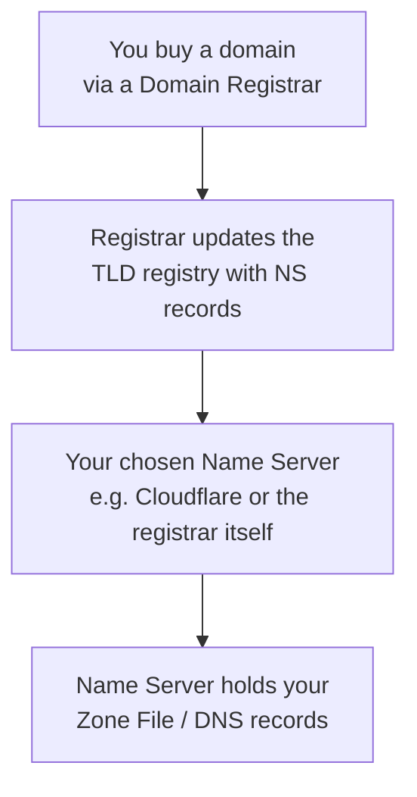

### What Is DNS?

- Your browser doesn't actually know how to reach a website by its name (e.g. `academy.networkchuck.com`) — it only knows how to reach it by **IP address**.
- **DNS (Domain Name System)** is the process/service that maps human-readable domain names to IP addresses — similar to how your phone's contacts app maps a person's name to their phone number.
- Without DNS, websites, email, and most of the internet would stop functioning.

---

### The Stub Resolver and Caching

- The **stub resolver** is the DNS client running on your own machine.
- Before going anywhere on the network, it first checks its **local cache** — if you've visited the site recently, the IP address may already be stored there, and no further lookup is needed.
- If it's not cached, the stub resolver reaches out to a **DNS server** configured on your network (either manually set or provided automatically via DHCP).
- A well-known public DNS server: **Google's `8.8.8.8`**.

---

### The Full DNS Resolution Journey

When your DNS server doesn't already know an answer, it works its way through a hierarchy of servers:

#### 1. Recursive DNS Server
- A **recursive DNS server** (e.g. Google's `8.8.8.8`) usually doesn't know every domain's IP address itself.
- It may have the answer cached from a previous lookup; if not, it queries other servers on your behalf until it finds the answer.

#### 2. Root Servers
- At the top of the DNS hierarchy sit the **root servers** — run by 13 named authorities (organizations like NASA, the DoD, Verisign), consisting of roughly 1,865 physical servers distributed worldwide.
- Root servers don't map domains to IPs directly. They only know about **top-level domains (TLDs)** — the part of a URL like `.com`, `.net`, `.co`, or country codes like `.jp`.
- A root server responds with a list of servers responsible for a given TLD.

#### 3. TLD Servers
- **TLD servers** (e.g. the `.com` TLD servers) maintain a database of which servers are authoritative for a given **second-level domain (SLD)** — e.g. `networkchuck.com`.
- They don't know the final IP address either — they point to the authoritative name server for that domain.

#### 4. Authoritative Name Server
- The **authoritative server** (in the example, Cloudflare) holds the actual **zone file** for the domain — the definitive record of everything about it, including the final IP address.
- This server responds with the actual IP address, which the recursive server then caches and passes back to your stub resolver.

> [!note]
> The portion of a URL to the left of the second-level domain (e.g. `academy` in `academy.networkchuck.com`) is called a **subdomain** — it can be pointed to a different location than the main site.

---

### Zone Files and DNS Record Types

A **zone file** is the authoritative record of everything about a domain. It starts with an **SOA (Start of Authority)** record identifying which name server is in charge, followed by various record types:

| Record Type | Full Name | Purpose |
|---|---|---|
| **A** | Address record | Maps a domain name to an **IPv4** address |
| **AAAA** | Quad-A record | Maps a domain name to an **IPv6** address |
| **NS** | Name Server record | Identifies the authoritative DNS server(s) for a domain |
| **MX** | Mail Exchanger record | Identifies which server(s) handle email for a domain |
| **PTR** | Pointer record | Reverse DNS — maps an IP address back to a domain name (used for verification/security) |
| **CNAME** | Canonical Name record | Creates an alias, pointing one domain (e.g. `www.networkchuck.com`) to the "real"/canonical domain |
| **TXT** | Text record | Free-form text; commonly used for email security (SPF, DKIM, DMARC) or ownership verification |

#### Email Security via TXT Records
- **SPF** — a TXT record specifying which mail servers are legitimate senders for a domain; other servers can check this list and reject mail from unauthorized sources.
- **DKIM** — a TXT record used to verify emails weren't altered in transit.
- **DMARC** — defines policy for how to handle mail that fails SPF/DKIM checks.

---

### Registering a Domain

- You register a domain through a **domain registrar** (e.g. Squarespace, which now includes Google Domains).
- **ICANN** (Internet Corporation for Assigned Names and Numbers) sits above the TLD authorities — it governs the overall DNS system and accredits registrars.
- After purchase, you choose your **name server** — this can be the registrar itself, or a third party like **Cloudflare** (often chosen for extra security/performance features).
- The registrar then updates the relevant TLD registry with **NS records** pointing to your chosen name server.
- **WHOIS** is a public database containing registrant information (name, company, address) for a domain — though this can be hidden via **WHOIS privacy** (an added fee through the registrar).

---

### DNS Security

#### The Problem: DNS Is Insecure by Default
- Standard DNS queries use **UDP port 53** in **plain text** — unencrypted.
- This makes DNS traffic vulnerable to:
  - **Sniffing** — a third party (a hacker, or your ISP) can see which websites you're visiting.
  - **DNS spoofing** — an attacker intercepts the query and responds with a fraudulent IP address, redirecting you to a malicious server.

#### The Solution: Encrypted DNS

| Method | Full Name | How It Works |
|---|---|---|
| **DoH** | DNS over HTTPS | Wraps DNS queries inside HTTPS traffic, making them encrypted *and* indistinguishable from regular web traffic |
| **DoT** | DNS over TLS | Encrypts DNS queries using TLS |
| **DNSCrypt** | — | Another method for encrypting DNS traffic |
| **DNSSEC** | DNS Security Extensions | A suite of tools that validates the authenticity of DNS queries/responses (not just encryption) |

- To use DoH: both your **client** (browser/OS) and your chosen **DNS server** (e.g. Cloudflare, Google) need to support it.
- Some DNS providers (e.g. **Quad9**) also offer built-in malware-domain blocking.

> [!tip]
> Enforcing encrypted DNS (DoH/DoT) across every device in a household or company is hard to do manually. Centralized tools exist to push these settings automatically to all connected devices via policy/MDM.

---

### Running Your Own DNS Server

- You can self-host a **recursive DNS server** on your own network (e.g. on a Raspberry Pi).
- It caches previously resolved domains locally and forwards unknown queries to an **upstream DNS server** you configure (e.g. Cloudflare, Google, Quad9).
- Popular self-hosted options mentioned: **AdGuard Home** and **Pi-hole** — both can also block ads network-wide.

---

#### Key Takeaways
- DNS translates human-readable domain names into IP addresses so browsers know where to actually connect.
- The **stub resolver** on your device checks its local cache first before querying an external DNS server.
- A full DNS lookup can involve a chain of servers: **recursive server → root server → TLD server → authoritative server**, each narrowing down the answer.
- A domain's **zone file** holds all its DNS records, starting with an **SOA** record.
- Common record types: **A** (IPv4), **AAAA** (IPv6), **NS** (name server), **MX** (mail), **PTR** (reverse DNS), **CNAME** (alias), **TXT** (free text, incl. SPF/DKIM/DMARC for email security).
- Registering a domain involves a **registrar**, overseen ultimately by **ICANN**, and requires choosing a **name server** to hold your zone file.
- Standard DNS traffic (UDP port 53) is unencrypted and vulnerable to sniffing and spoofing.
- **DoH** and **DoT** encrypt DNS queries; **DNSSEC** validates their authenticity; both address different security gaps.
- You can self-host your own recursive DNS resolver (e.g. Pi-hole, AdGuard Home) for caching, privacy, and ad-blocking.

#### Quick Reference
| Term / Record | Purpose | Example |
|---|---|---|
| Stub resolver | DNS client on your local machine | Checks cache before querying a DNS server |
| Recursive DNS server | Resolves queries on your behalf by asking other servers | Google `8.8.8.8` |
| Root server | Top of the DNS hierarchy; knows only about TLDs | Directs to `.com` TLD servers |
| TLD server | Knows the authoritative server for second-level domains | Directs to a domain's name server |
| Authoritative server | Holds the actual zone file / final answer | Cloudflare hosting `networkchuck.com` |
| A record | Domain → IPv4 address | `networkchuck.com → 104.118.42.139` |
| MX record | Identifies mail servers for a domain | `mail.networkchuck.com` |
| CNAME record | Alias one domain to another | `www.networkchuck.com → networkchuck.com` |
| DoH | Encrypts DNS via HTTPS | Enabled in browser or via DNS provider |
