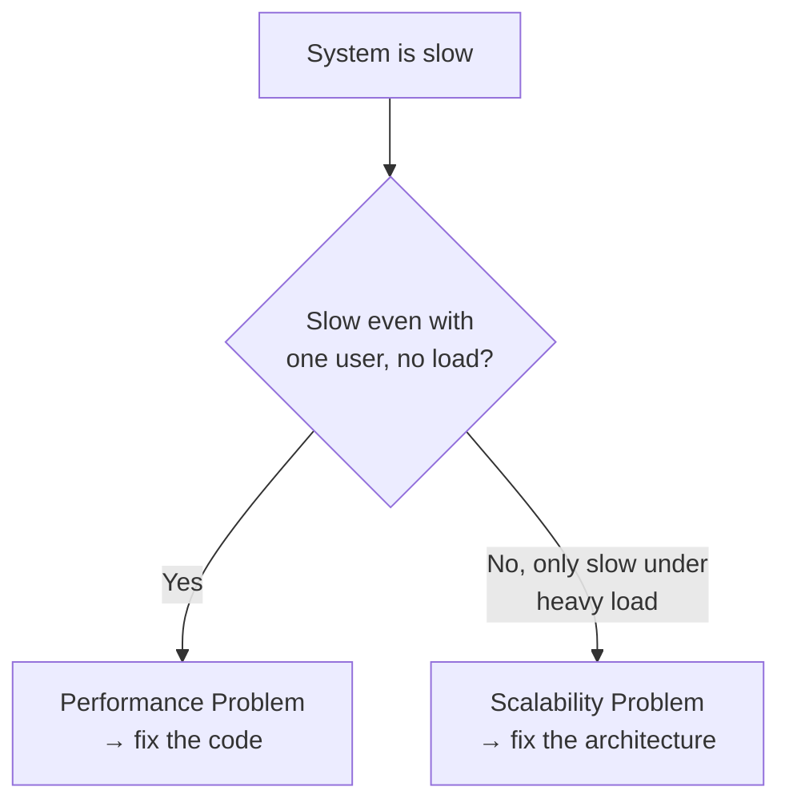

### Why This Distinction Matters

- **[[Performance]]** and **[[Scalability]]** are two of the most confused terms in system design.
- Getting the difference right lets you diagnose problems correctly and design systems that hold up under real-world load; getting it wrong means systems tend to fail right when it matters most (e.g. under a traffic spike).

---

### Performance: How Fast Is *One* Unit of Work?

- Performance is about **speed** — how fast the system handles a **single unit of work** (one request, one transaction).
- It has nothing to do with number of users yet — it's purely "how fast can we do this one thing?"

**What performance measures:**

| Metric | Question It Answers |
|---|---|
| **Latency** | How fast does it respond? |
| **Throughput** | How much work can be done per second? |
| **Resource usage** | How much CPU, memory, or disk I/O does one request take? |

> [!tip] The Simplest Performance Test
> If your system is slow for a **single user**, even with basically no traffic at all — that's **not** a scalability problem. That's a performance problem: the system itself is inefficient at its most basic job.

**Common causes of poor performance:**
- An inefficient algorithm doing unnecessary work
- A missing database index, forcing a full table scan on every query

> [!note]
> Performance problems can usually be fixed with **targeted code changes** — a patch to a specific piece of code.

---

### Scalability: Does the System Improve *With More Resources*?

- Scalability is about a **relationship**, not a fixed speed: when you add more resources (servers, CPU, memory), does the system actually do **more useful work**?
- "Useful work" can mean:
  - Serving more requests per second
  - Handling a sudden spike in concurrent users
  - Processing a dataset that's grown much larger

> [!warning] The Highway Analogy
> Adding more servers is like adding more lanes to a traffic jam. If adding lanes just makes the gridlock worse, the problem isn't the number of lanes — it's the fundamental design of the interchanges. That's a system that doesn't scale.

---

### The Core Distinction

| | Performance Problem | Scalability Problem |
|---|---|---|
| **Symptom** | System is slow even for a **single user** | System is fast for one user, but **falls over under heavy load** |
| **Root cause** | Inefficient code/algorithm | Fundamental architecture/design |
| **Typical fix** | Targeted code change | Architectural redesign |
| **When it must be addressed** | Can often be patched later | Must be designed in from day one |

---

### Worked Example: The App That Went Viral

1. Launch day: 10 users → everything is instant, feels perfect.
2. App goes viral: 10,000 users hit it at once → the system grinds to a halt, latency spikes.
3. Obvious fix attempted: **throw more servers at it** → nothing improves, still slow.
4. Diagnosis: this is a **textbook scalability problem** — more resources didn't translate into more useful work, because the bottleneck is architectural, not code-level.

---

### Why Scalability Is Harder to Fix

Unlike a performance bug, scalability **can't be patched after the fact** — it has to be designed in from the start. A scalable design means you've already answered questions like:
- **Data partitioning** — how is data split so that not every server is hitting the same database row (a common bottleneck)?
- **Component coordination** — how much shared state exists between parts of the system?

Getting these foundational architectural decisions wrong means the system can collapse the moment it becomes popular — no amount of added hardware fixes it.

---

### Why This Matters for Engineers

- Prevents **premature optimization** — building an overly complex, scalable-from-day-one system when a simple performance tuneup was all that was actually needed.
- Helps you correctly diagnose the **real source** of a problem instead of guessing.
- Improves how clearly you can discuss system design tradeoffs, e.g. in an interview setting.

> [!note] One-Line Summary
> **Performance** is about how fast you are *right now*. **Scalability** is about how gracefully you handle success *later*. You need to design for both — but you have to know which problem you're actually solving.

---

#### Key Takeaways
- **Performance** = speed for a single unit of work (one request/transaction), measured via latency, throughput, and resource usage.
- **Scalability** = whether adding more resources produces more useful work, under growing load.
- The simplest diagnostic test: slow with **one user, no load** → performance problem. Fast alone, but falls over **under heavy load** → scalability problem.
- Performance issues are usually fixable with targeted code changes (e.g. better algorithms, adding a database index).
- Scalability issues are architectural — they involve decisions like data partitioning and shared state, and must be designed in from the start, not patched later.
- Throwing more servers at a scalability problem doesn't help if the underlying architecture is the bottleneck (the highway/traffic-jam analogy).
- Knowing the difference prevents premature optimization and helps correctly diagnose whether a fix belongs in the code or the architecture.
