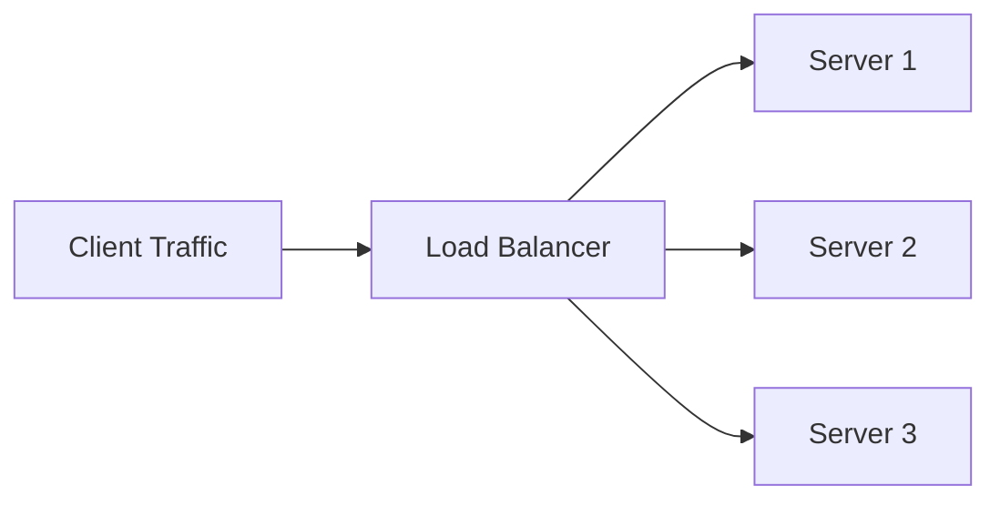
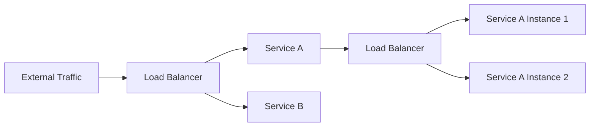
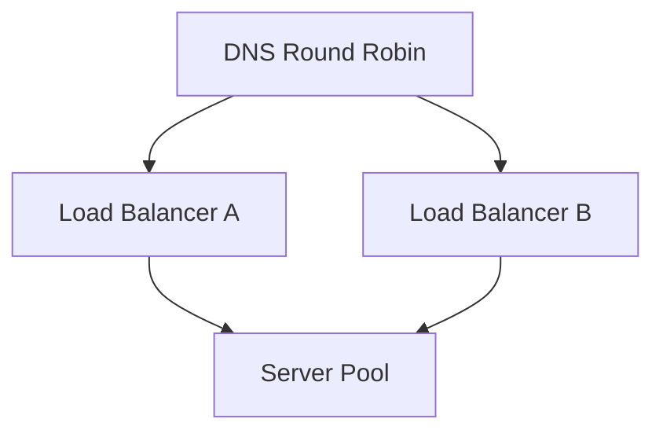

### Why Load Balancers Exist

- Web applications run on servers with **finite resources** — memory, processing power, network connections.
- As traffic grows, these resources become limiting factors. The point at which a server can no longer keep up is called the system's **capacity**.
- Early scaling options: increase the server's memory/CPU, or use resources more efficiently (e.g. multi-threading).
- Eventually, though, traffic exceeds what a **single server** can handle no matter how it's optimized.
- The only remaining solution: add **more servers** — known as **horizontal scaling**.
- Once multiple servers can serve a request, something has to decide **which server gets which request** — that's the job of a **load balancer**.

---

### How Load Balancers Distribute Traffic

A good load balancer aims to **maximize system capacity** and **minimize request fulfillment time**. It does this using one of several strategies:

| Strategy | How It Works |
|---|---|
| **Round Robin** | Servers are assigned requests in a repeating sequence, so the next server used is guaranteed to be the least recently used one |
| **Least Connections** | Assigns the request to whichever server is currently handling the fewest active requests |
| **Consistent Hashing** | Similar to database sharding — a server is consistently assigned based on a value like IP address or URL |

---

### Where Load Balancers Operate

- Load balancers can work at different **network layers**:
  - Higher layers, like **HTTP**
  - Lower layers, like **TCP**
  - Or even be implemented in **hardware**
- Since a load balancer handles traffic for an entire pool of servers, it needs to be **efficient** and **highly available**.

#### Common Implementations
- Engineering teams rarely build their own — they typically use an industry-standard **reverse proxy**, such as:
  - **NGINX**
  - **HAProxy**
- These tools also handle related functions:
  - **SSL termination**
  - **Health checks**
- Most cloud providers offer built-in load balancers too — e.g. **AWS's Elastic Load Balancer (ELB)**.

---

### When to Use a Load Balancer

- Use one whenever a system would benefit from **increased capacity** or **redundancy**.
- Commonly sits between **external traffic** and the application servers.
- In a **microservice architecture**, it's important to place a load balancer in front of **each internal service** — this lets every part of the system scale independently.

---

### What Load Balancing Can't Fix

> [!warning]
> Load balancing does not solve every scaling problem. Adding more web servers won't compensate for:
> - Poor **database performance**
> - High **algorithmic complexity** (inefficient calculations)
> - Slow or unreliable **third-party APIs**
> - Other forms of **resource contention**

- For these cases, designing the system to process tasks **asynchronously** (e.g. via a **job queue**) may be the actual fix — not more servers.

> [!note]
> **Load balancing** is distinct from **rate limiting**. Rate limiting intentionally throttles or drops traffic to prevent abuse by a specific user or organization — it's a different concern from distributing legitimate traffic across servers.

---

### Advantages of Load Balancers

| Benefit | Description |
|---|---|
| **Scalability** | Makes it easy to scale up or down with demand by adding/removing back-end servers |
| **Reliability** | Provides redundancy; automatically detects and replaces unhealthy servers to minimize downtime |
| **Performance** | Distributes workload evenly, improving average response time |

---

### Considerations When Using a Load Balancer

- **The load balancer itself can become a bottleneck or single point of failure** as scale increases.
  - Solution: use **multiple load balancers**, with **DNS round robin** distributing traffic across them.
- **Session data**: unless configured otherwise, the same user's requests can be served by *different* back-end servers on different requests. This is problematic for apps relying on session data that isn't shared across servers.
- **Deployments take longer**: rolling out new server versions requires the load balancer to gradually roll traffic onto new servers while draining requests from old ones — this needs more machines and more time than a simple in-place deploy.

---

#### Key Takeaways
- Servers have finite capacity; once vertical scaling (bigger/more efficient single servers) is exhausted, **horizontal scaling** (more servers) becomes necessary.
- A **load balancer** decides which server handles each incoming request once there's more than one server available.
- Common distribution strategies: **Round Robin**, **Least Connections**, and **Consistent Hashing**.
- Load balancers can operate at different network layers (HTTP, TCP) or even in hardware, and are typically implemented via reverse proxies like **NGINX**/**HAProxy** or managed cloud services like **AWS ELB**.
- In microservice architectures, place a load balancer in front of **each** internal service, not just at the system's edge.
- Load balancing **cannot** fix database bottlenecks, inefficient algorithms, or unreliable third-party APIs — those need different solutions, like async job queues.
- Load balancing is **not** the same as rate limiting.
- Benefits: **scalability**, **reliability** (via health checks/redundancy), and improved **performance**.
- At scale, load balancers themselves need redundancy (multiple load balancers + DNS round robin) to avoid becoming a single point of failure.
- Watch for **session-affinity issues** (requests landing on different servers) and **slower deployments** (traffic must be gradually shifted and drained during rollouts).
