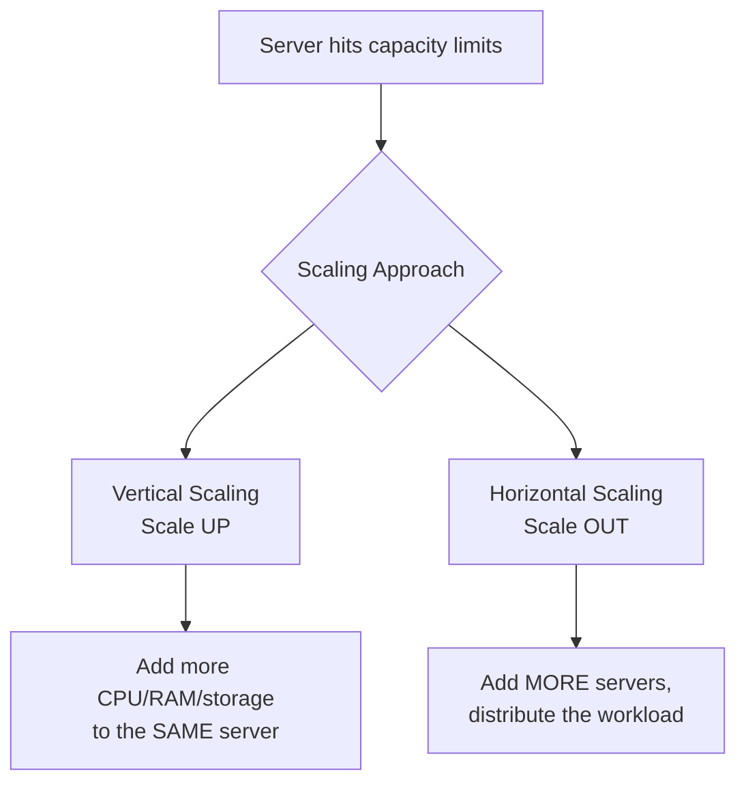

### The Core Question

When a server can no longer keep up with growing traffic, there are two fundamental scaling approaches:
- **Vertical scaling** ("scaling up")
- **Horizontal scaling** ("scaling out")

---

### [[Vertical Scaling]] (Scaling Up)

- Means adding more power to your **existing server** — more CPUs, RAM, storage, or network bandwidth.
- **Example:** a cloud database maxing out an 8-core starter server gets upgraded to a 32-core instance with faster SSD storage, 96GB RAM, and 10-gigabit networking.

#### Advantages
- **Simple to implement** — upgrading existing hardware is easier than standing up new servers.
- **Cost-effective short term** — you only pay for the additional resources you actually need.
- **Easier maintenance** — everything runs on one machine, simplifying upgrades and maintenance.

#### Disadvantages
- **Single point of failure** — if the server fails, everything goes down.
- **Limited scaling headroom** — there are physical limits to how powerful a single server can get.
- **High cost at large scale** — high-end hardware upgrades get expensive fast.

---

### [[Horizontal Scaling]] (Scaling Out)

- Means adding **more servers** and distributing the workload across them, instead of making one server bigger.
- **Example:** instead of one large box, spread capacity across three separate 8-core nodes.
- Modern **cloud auto-scaling** and **serverless computing** have significantly simplified this approach for many workloads.

#### Advantages
- **High availability** — redundant servers and failover mechanisms increase overall availability.
- **Predictable growth headroom** — add more servers as needed, scaling capacity alongside demand.
- **Improved performance** — spreading workload across multiple servers can boost overall performance.
- **Lower cost over time** — distributing load across efficient servers can beat the cost of continually upgrading to high-end hardware.

#### Disadvantages
- **Complex to implement** — managing a distributed system is harder than managing a single server, especially for **stateful systems** like databases.
- **Higher upfront cost**, coming from several angles:
  - **Sharding** the database/application to distribute workload is complex and development-intensive.
  - **Data consistency** across nodes requires replication mechanisms, adding overhead and operational cost.
  - **Load balancing** traffic efficiently across servers requires a robust solution, adding further software/hardware cost.

---

### Vertical vs Horizontal: Side-by-Side

| | Vertical Scaling | Horizontal Scaling |
|---|---|---|
| **What changes** | Same server, more resources | More servers, distributed load |
| **Implementation complexity** | Simple | Complex (esp. for stateful systems) |
| **Cost profile** | Cheaper short-term, expensive at large scale | Higher upfront cost, cheaper long-term |
| **Failure resilience** | Single point of failure | High availability via redundancy |
| **Scaling ceiling** | Limited by physical hardware limits | Effectively unbounded (add more nodes) |
| **Best suited for** | Simpler setups, short-term fixes | Unpredictable/bursty workloads, long-term growth |

---

### Which Should You Choose?

There's no universal answer — it depends on several factors:

| Factor | Consideration |
|---|---|
| **Budget** | Vertical scaling is cheaper short-term; horizontal scaling can be more cost-effective long-term |
| **Workload pattern** | Unpredictable or bursty traffic favors horizontal scaling, which handles peak demand better |
| **Performance requirements** | Performance-sensitive applications benefit from horizontal scaling's load distribution |
| **Engineering overhead** | If horizontal scaling requires complex sharding/mechanisms, factor in the added development and operational cost |

> [!note]
> Scaling isn't a one-time decision — infrastructure needs evolve as a business grows, so scaling strategy should be expected to adapt over time rather than being "solved" once.

---

#### Key Takeaways
- **Vertical scaling** = adding more power (CPU/RAM/storage/network) to an existing server.
- **Horizontal scaling** = adding more servers and distributing the workload across them.
- Vertical scaling is simpler and cheaper short-term but has a hard ceiling and creates a single point of failure.
- Horizontal scaling offers high availability and long-term cost efficiency, but is more complex to implement — especially for stateful systems like databases.
- Horizontal scaling's real costs come from sharding, data consistency/replication, and load balancing — not just adding servers.
- Choice of approach depends on budget, workload predictability, performance requirements, and how much added engineering complexity you're willing to take on.
- Scaling strategy should be treated as an ongoing, evolving process rather than a single fixed decision.
