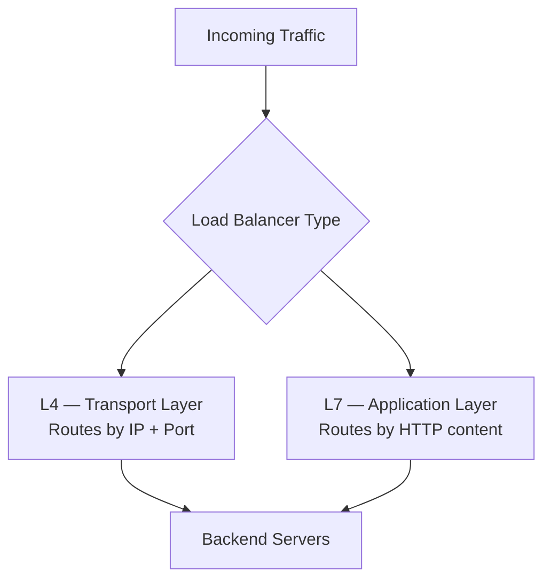

### Two Types of Load Balancers

Load balancers distribute incoming traffic across multiple servers to optimize resource utilization and prevent any single server from becoming a bottleneck. Based on the **OSI model**, there are two primary types:

| Type | Also Known As | OSI Layer |
|---|---|---|
| **L4 (Layer 4)** | Network / Transport Load Balancer | Transport Layer |
| **L7 (Layer 7)** | Application Load Balancer | Application Layer |

---

### [[Layer 4 Load Balancing]]

- Operates at the **transport layer** — routes traffic based on **IP address** and **TCP/UDP ports**, without inspecting the actual content of the message.

**Use cases:**
- Applications needing **high throughput** and **low latency**.
- Simple load-balancing scenarios where distributing by IP/port is sufficient.
- Primarily used for **non-HTTPS** traffic or **internal** network load balancing (not public-facing).

---

### [[Layer 7 Load Balancing]]

- Operates at the **application layer** — routes traffic based on the actual **content** of the message: request headers, data, etc.

**Use cases:**
- Web applications/services where routing decisions depend on **HTTP content**.
- Applications requiring **advanced security features** and **comprehensive health checks**.
- Scenarios needing **session persistence** (sticky sessions) or **SSL offloading**.

> [!note]
> Example: routing a request to a load balancer in a specific region (e.g. Spain) based on inspecting where the request originated, or tenant-based routing based on message content — this kind of content-aware routing is only possible at Layer 7.

---

### Tradeoffs: L4 vs L7

| Dimension | Layer 4 | Layer 7 |
|---|---|---|
| **Performance** | High performance, low latency | Higher latency (due to deep packet inspection) |
| **Resource usage** | Low CPU/memory usage | High CPU/memory usage |
| **Complexity** | Simple to configure and manage | More complex to configure and manage |
| **Routing capability** | IP- and port-based routing | Content-based routing (headers, cookies, message data) |
| **Security** | Limited; basic TCP/UDP health checks | Enhanced application-level security; comprehensive health monitoring |
| **Scalability** | Highly scalable (stateless operations) | Scalable, but must handle stateful features (e.g. sticky sessions) |
| **Flexibility** | Limited (IP/port-based only) | Highly flexible — supports SSL termination, caching, compression |
| **DoS mitigation** | Basic (IP/port-based only) | More advanced (content/metadata-based guardrails) |

> [!tip]
> The pattern across nearly every dimension: **L4 trades capability for speed and simplicity; L7 trades speed and simplicity for capability and control.**

---

### Choosing Between L4 and L7

Choosing the right layer means evaluating your application's specific requirements against the tradeoffs above — performance, security, complexity, scalability, and more.

- **Layer 4**: simplicity and high performance, but lacks advanced features and content awareness.
- **Layer 7**: great flexibility, security, and advanced routing, at the cost of increased complexity and resource usage.

> [!warning]
> Complexity isn't just about initial implementation/configuration — it also includes the ongoing cost of **operating and maintaining** the system long-term. Factor that into the decision, not just build cost.

- When designing a globally distributed, scalable system, load balancing capability (and which layer fits your needs) is a core design decision, not an afterthought.

---

#### Key Takeaways
- **L4 load balancers** operate at the transport layer, routing by IP/port without inspecting message content.
- **L7 load balancers** operate at the application layer, routing based on actual HTTP content (headers, cookies, data).
- L4 is faster, simpler, and cheaper on resources; L7 is slower and more resource-intensive due to deep packet inspection, but far more flexible.
- L7 is required for content-based routing, sticky sessions, SSL offloading, and advanced/comprehensive health checks.
- L4 is best suited for high-throughput, low-latency, non-HTTPS, or internal traffic scenarios.
- Security and DoS mitigation are both more advanced at L7, since decisions can be based on content/metadata rather than just IP/port.
- L4 is more inherently scalable due to being stateless; L7 must account for stateful features like sticky sessions.
- The choice between L4 and L7 should be driven by your application's actual requirements across performance, security, complexity, and scalability — including long-term maintenance overhead, not just initial setup.
