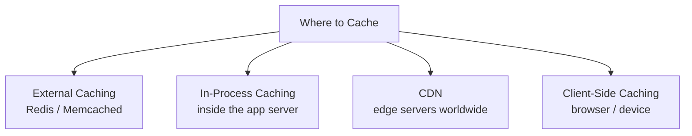
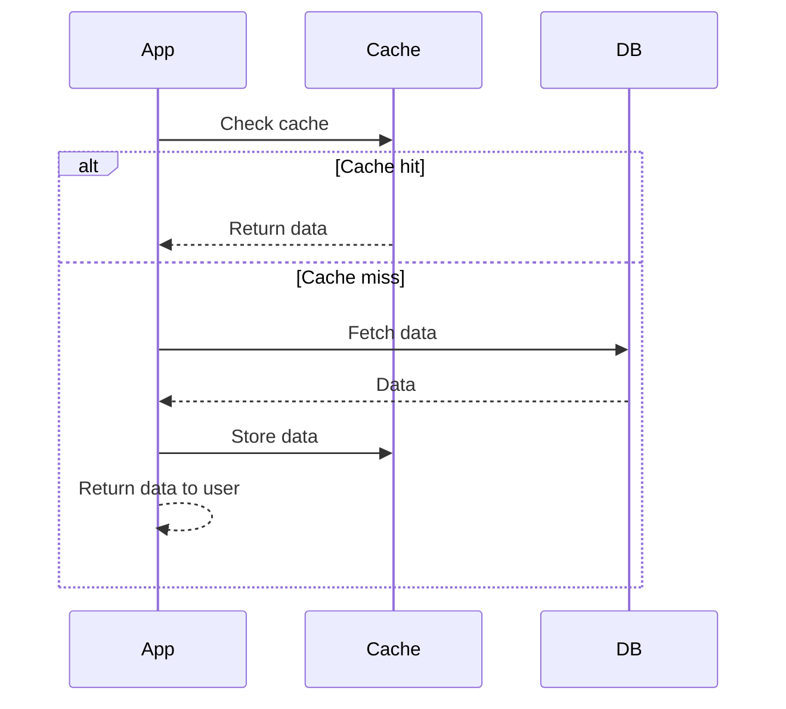
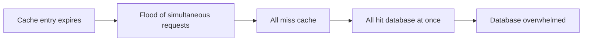

### What Is Caching?

- A **cache** is temporary storage that keeps recently used data close by so it can be fetched faster next time.
- **Why it matters — the speed gap:**

| Storage | Typical Access Time |
|---|---|
| Disk (e.g. SSD, database) | ~1 millisecond |
| Memory / RAM (cache) | ~100 nanoseconds |

- Memory access is roughly **10,000x faster** than disk. That gap compounds fast at scale (thousands of requests/second).
- **Core tradeoff:** caching trades a bit of storage and complexity for speed.

---

### Where Can You Cache Data?

#### 1. External Caching (most common in interviews)
- A dedicated caching service (**Redis**, **Memcached**) running on its own server, fully separate from the application and database.
- **Flow:** app checks the cache → **cache hit** = instant return → **cache miss** = fetch from database, store a copy in the cache, return to client.
- Because it's a shared, global component, **multiple application servers can all share the same external cache** — once one server caches data, all others reuse it instantly instead of each separately hitting the database.

#### 2. In-Process Caching
- Data cached directly inside the application server's own memory — skips the network hop entirely, making it the **fastest** kind of caching.
- **Tradeoff:** each server has its own separate in-process memory, so data cached on one server isn't visible to others → inconsistency risk and potential wasted memory.
- Generally not needed in interviews unless discussing low-level optimization or ultra-low latency needs (e.g. caching config data or small lookup tables used by every request). Default should still be external caching.

#### 3. CDN (Content Delivery Network)
- A geographically distributed network of edge servers that cache content physically closer to users — optimizing for **network latency**, not memory-vs-disk speed.
- **Example impact:** origin server in Virginia, user in Australia → ~300–350ms round trip without a CDN, vs. ~20–40ms hitting a nearby edge server with one.
- **Flow:** request hits nearest edge server → cache hit = immediate return → cache miss = CDN fetches from origin (e.g. S3/blob storage), caches it, returns it.
- Beyond static media, modern CDNs can also cache public API responses, HTML pages, and even run edge logic for personalization — but **media delivery** (images, video, static assets) is the most common interview use case.

#### 4. Client-Side Caching
- Data stored directly on the user's device (browser HTTP cache/local storage, or in-memory/on-disk for mobile apps).
- Fastest possible option since data never leaves the device, but offers the **least control** — freshness and validation are harder to manage.
- Comes up far less often in interviews; mainly relevant for offline functionality or client-heavy workloads (e.g. an app caching data locally while offline, then syncing later).

---

### Cache Architectures

A cache architecture defines the **order** in which reads/writes happen across the application, cache, and database.

#### Cache-Aside (default choice — know this one cold)

- App checks cache first; hit = return immediately; miss = fetch from DB, store in cache, return to user.
- Keeps the cache lean — only caches data that's actually been requested.
- **Downside:** a cache miss adds latency (DB fetch + cache write before returning).

#### Write-Through
- App writes directly to the cache; the cache **synchronously** writes that data to the database before the write is considered complete.
- Requires a caching library/framework that supports this behavior (Redis/Memcached don't natively) — e.g. Spring Cache, Hazelcast.
- **Downsides:** slower writes (waiting on both cache + DB), can pollute the cache with rarely-read data, and suffers from the **dual write problem** (cache and DB can end up inconsistent if one write succeeds and the other fails).
- Only worth bringing up when reads must always be fresh and the system can tolerate slightly slower writes.

#### Write-Behind (Write-Back)
- Like write-through, but the cache writes to the database **asynchronously**, usually in batches.
- Makes writes much faster, but introduces **data loss risk** if the cache crashes before flushing to the DB.
- Best suited for cases where write throughput matters more than immediate consistency (e.g. analytics/metrics pipelines).
- Interviewer guidance: powerful if you're an expert with a strong justification, but generally best avoided unless you can defend it well.

#### Read-Through
- Similar to cache-aside, except the **cache itself** handles the database lookup on a miss (rather than the application).
- This is essentially how **CDNs work** — cache miss → cache fetches from origin → stores it → returns it.
- Mainly relevant when discussing CDNs/edge caching; for general application caching, cache-aside remains the simpler default (no special adapter/framework needed).

> [!tip]
> Interviewers care far more about whether you can **describe the read/write behavior clearly** than whether you remember these exact names. If you forget "cache-aside," it's fine to just say: "I'll check the cache first, and if it's not there, I'll go to the database and update the cache."

---

### Cache Eviction Policies

Memory is limited, so a policy is needed to decide what stays and what gets replaced.

| Policy | Evicts | Notes |
|---|---|---|
| **LRU** (Least Recently Used) | Items not accessed recently | Most common default in interviews |
| **LFU** (Least Frequently Used) | Items accessed least often, even if recent | Good fit when access patterns are highly skewed (a few items read far more than others) |
| **FIFO** (First In, First Out) | Oldest item, regardless of usage | Simple; rarely the right choice in interviews |
| **TTL** (Time To Live) | Items after a fixed expiration time | Great for data that can go stale (sessions, API responses) |

> [!note]
> Implementation details (e.g. LRU via linked list/priority queue) are almost always out of scope for a system design interview — focus on *which policy* and *why*, not internals.

---

### Common Caching Problems

#### Cache Stampede (Thundering Herd)
- Happens when a popular cache entry's TTL expires, and a flood of requests all try to rebuild it **at the same time**, hitting the database simultaneously and potentially overwhelming it.
- **Example:** homepage feed cached with a 60-second TTL, serving 100,000 req/sec. The moment it expires, all 100,000 requests miss at once and slam the database.

**Two common fixes:**
1. **Request coalescing (single flight)** — when multiple requests try to rebuild the same cache key, only the first is allowed to actually execute; the rest wait and read the result once it's ready.
2. **Cache warming** — proactively refresh popular keys just *before* they expire (e.g. refresh at the 55-second mark of a 60-second TTL), so they never actually go stale/expire.

#### Cache Consistency
- Occurs because most systems **read from cache but write to the database**, creating a window where the cache holds stale data.
- **Example:** a user updates their profile picture → DB gets the new value, but the cache still serves the old one until eviction.

**Strategies (no perfect fix — depends on freshness requirements):**
| Strategy | Approach |
|---|---|
| **Invalidate on write** | Delete the cache key when the DB is updated; next read misses and repopulates the cache with fresh data |
| **Short TTLs** | Accept some staleness, but bound it with a short expiration window |
| **Accept eventual consistency** | Fine for feeds, analytics, metrics, or anything where a brief delay in freshness is acceptable |

#### Hot Keys
- A single cache entry that receives disproportionately more traffic than everything else — can bottleneck a single cache node/shard even when the overall cache is working as designed.
- **Example:** "Taylor Swift's profile" on a social app receiving millions of requests/sec, overloading one Redis shard.

**Two common fixes:**
1. **Replicate the hot key** across every shard/cache instance, so the application server can load-balance requests evenly across all of them instead of hammering one.
2. **Add a local fallback cache** — use in-process caching to keep extremely hot values in the app's own memory, avoiding a round trip to Redis entirely for repeated requests.

> [!warning]
> Caching helps scale reads, but doesn't make a system infinitely scalable — interviewers specifically probe for whether you understand these limitations (stampedes, consistency, hot keys), not just the happy path.

---

### How to Discuss Caching in a System Design Interview

#### When to Bring It Up
Don't add a cache just because — justify it with one of these four triggers:

| Trigger | Example Justification |
|---|---|
| **Read-heavy workload straining the DB** | "100M DAU × 20 requests/day = 2B reads/day — more than our DB can handle, so we cache to offload reads." |
| **Expensive queries** | A personalized feed requiring multiple joins across tables — cache the result with a short TTL (e.g. 60s). |
| **High database CPU** | (Real-world scenario, less common in interviews since you lack live metrics) — cache in front of a DB pegging its CPU. |
| **Latency requirements** | A non-functional requirement like a 100ms response time that a raw DB query can't meet. |

**Pattern:** identify the bottleneck → quantify it with rough numbers → explain how caching solves it.

#### How to Introduce It (in order)
1. **Identify the bottleneck** (as above).
2. **Decide what to cache** — not everything; focus on data that's read frequently, doesn't change often, or is expensive to fetch/compute. Be explicit about the **cache key** and what values are stored.
3. **Choose the cache architecture** — state it plainly, e.g. "cache-aside on read: check Redis first, fall back to DB on miss, store result, return to user."
4. **Mention the eviction policy** (LRU/LFU/TTL) with justification relevant to your system.
5. **Address potential downsides** relevant to your specific design — stampedes, consistency, hot keys — rather than reciting all three regardless of relevance.

> [!tip]
> Caching most often comes up during the **deep dive / non-functional requirements** phase of an interview, when discussing scale or latency — it's a very common topic, so having this sequence down is valuable.

---

#### Key Takeaways
- Caching works because memory access (~100ns) is roughly 10,000x faster than disk access (~1ms), and that gap compounds heavily at scale.
- Four places to cache: **external** (Redis/Memcached, most common default), **in-process** (fastest but inconsistent across servers), **CDN** (solves network latency for geographically distributed users), and **client-side** (fastest but least control, rarely relevant in interviews).
- **Cache-aside** is the default architecture to know; write-through, write-behind, and read-through each solve narrower problems with their own tradeoffs.
- Eviction policies: **LRU** (default), **LFU** (skewed access patterns), **FIFO** (rarely right), **TTL** (staleness-sensitive data).
- The three big caching problems interviewers probe: **cache stampede/thundering herd** (fix: request coalescing or cache warming), **cache consistency** (fix: invalidate on write, short TTL, or accept eventual consistency), and **hot keys** (fix: replicate the key across shards, or add a local fallback cache).
- Only introduce caching in an interview with a clear, quantified justification — read-heavy load, expensive queries, high DB CPU, or latency requirements.
- When introducing caching, follow the sequence: identify the bottleneck → decide what to cache (and the cache key) → choose the architecture → pick an eviction policy → address relevant downsides.

#### Quick Reference
| Term | Purpose | Example |
|---|---|---|
| Cache-aside | App checks cache, falls back to DB on miss, updates cache | Default caching pattern for most systems |
| Write-through | Synchronous write to cache + DB together | Used when reads must always be fresh |
| Write-behind | Async write to DB, cache updated first | Analytics/metrics pipelines |
| Read-through | Cache itself handles DB lookup on miss | How CDNs work |
| TTL | Expire cache entries after a set time | 60-second TTL on a homepage feed |
| Request coalescing | Only first request rebuilds a key; others wait | Prevents cache stampede |
| Invalidate on write | Delete cache key when DB is updated | Fix for cache consistency issues |
